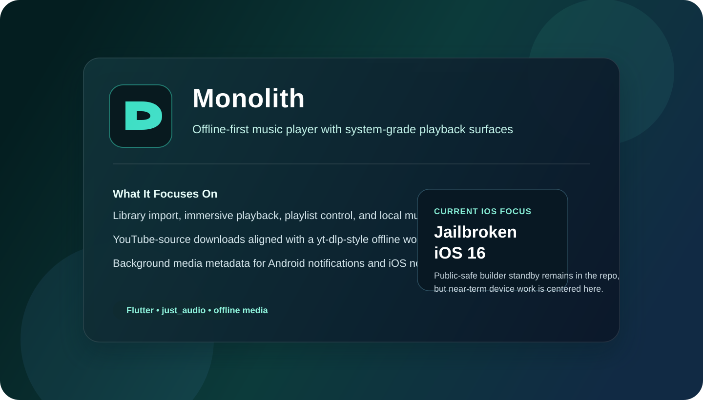
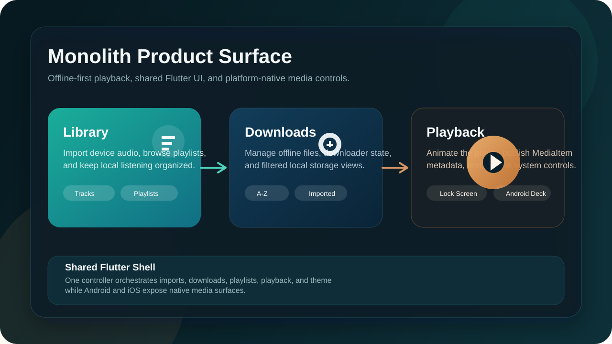
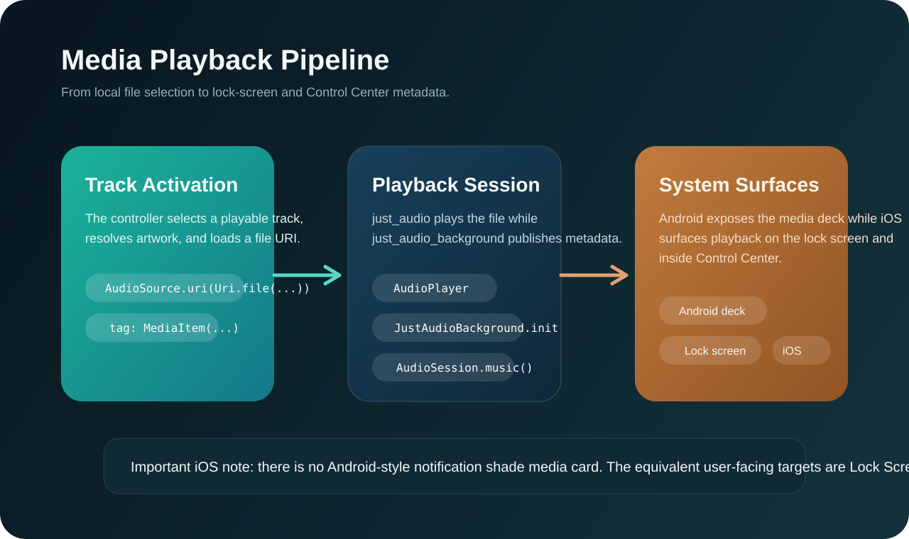
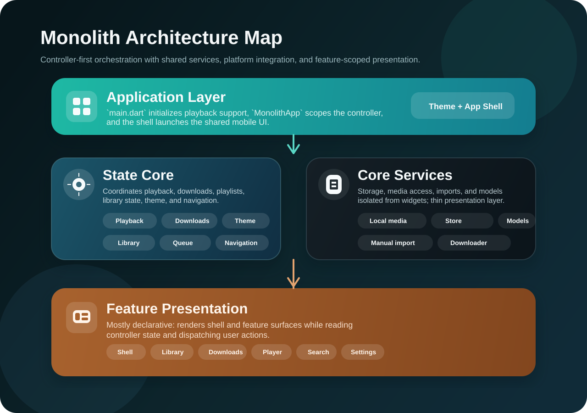
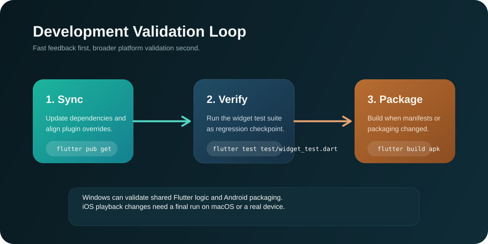

<div align="center">



<h1>Monolith</h1>

<p><strong>An offline-first Flutter music player for Android &amp; iOS</strong><br/>
Local listening, managed downloads, playlist control, and system-grade playback surfaces — from one shared codebase.</p>

<p>
  
  <a href="https://github.com/naveed-gung/Monolith/releases/latest"></a>
  <a href="https://github.com/naveed-gung/Monolith/releases"></a>
  
  <a href="LICENSE"></a>
</p>

<p>
  <a href="#-download">Download</a> ·
  <a href="#-features">Features</a> ·
  <a href="#-architecture">Architecture</a> ·
  <a href="#-getting-started">Getting started</a> ·
  <a href="#-license">License</a>
</p>

</div>

---

##  Overview

Monolith is a personal music player built around a simple idea: **your library is yours.** Downloaded and imported tracks live on the device as a permanent, manifest-backed collection — not a disposable streaming session — and surface natively on the iOS lock screen, iOS Control Center, and the Android media notification deck.

<details>
<summary><strong>Why I built this</strong></summary>

<br/>

I got tired of the choice: either manage downloads on Windows and manually transfer files, or rely on some third-party app on my phone with questionable quality and even more questionable permissions. Every existing solution felt like a compromise.

So I thought — if I'm already trusting a third-party app, why not just build my own? At least then it would work exactly how I want, respect my library as *mine*, and actually handle offline playback without nagging me to subscribe to something.

**Monolith is that app** — a personal project that turned into something I use every day.

</details>

| | |
| --- | --- |
| **Platforms** | Android · iOS 16.4+ (primary test device iOS 16.7) |
| **Core stack** | Flutter · `just_audio` · `just_audio_background` · `audio_session` · `on_audio_query` |
| **State** | A single controller-driven app state (`MonolithController`) |
| **Download model** | yt-dlp-oriented workflow; current mobile backend is `youtube_explode_dart` |
| **Playback surfaces** | Android media deck · lock screen · headset buttons · iOS Control Center |

---

##  Download

Grab the latest build from the [**Releases**](https://github.com/naveed-gung/Monolith/releases/latest) page:

| Platform | File | Install |
| --- | --- | --- |
| **Android** | `monolith.apk` | Download and open on any Android 7.0+ device (allow install from unknown sources). |
| **iOS** | `monolith.ipa` | Unsigned build. Sideload with [AltStore](https://altstore.io) / [Sideloadly](https://sideloadly.io), re-sign with your own Apple ID in Xcode, or install it **permanently** with TrollStore (see below). |

> **Jailbroken or TrollStore-capable iOS?**
> - **Jailbroken device** → install `monolith.ipa` permanently with [**TrollStore**](https://github.com/opa334/TrollStore). No 7-day re-sign, no computer, no developer account.
> - **iOS 16.7.x** → use [**TrollStore Lite**](https://github.com/opa334/TrollStore) to install the same IPA permanently.
>
> TrollStore-installed apps stay signed forever, so this is the smoothest way to run Monolith on a supported iPhone.

---

##  Features



- **Library** — import on-device audio, browse and manage playlists, organise listening.
- **Downloads** — fetch and manage offline files with progress, pause, cancel, retry, and fatal-error handling.
- **Player** — full-screen player with animated artwork, scrubbing, repeat/shuffle, and queue navigation.
- **Search** — surface tracks instantly and jump straight into playback.
- **Storage** — browse, share, and inspect every downloaded file in Monolith's own folder.
- **System integration** — background metadata for Android notifications and the iOS lock screen / Control Center.
- **Theming** — light/dark with a user-selectable accent.

### Experience pillars

| Pillar | What it delivers |
| --- | --- |
| **Offline listening** | Downloaded and imported tracks stay available as a local-first library — no live stream required. |
| **Unified player** | One controller keeps queue, metadata, and transport state consistent across every surface. |
| **System integration** | Notification controls, headset buttons, lock screen, and Control Center are first-class. |
| **Library ownership** | Imports, playlists, and manifest-backed downloads form a permanent collection. |

---

##  Playback pipeline



`just_audio` renders the file, `just_audio_background` publishes a `MediaItem` for the system, and `audio_session` pins a music-friendly session so the current track surfaces correctly on the iOS lock screen, iOS Control Center, and Android's media notification deck.

> **Platform note:** iOS does not expose an Android-style notification-shade media card. The equivalent surfaces are the Lock Screen and Control Center.

---

##  Download pipeline

Monolith fetches music from YouTube-source inputs for offline playback and local library management.

- The downloader surface is shaped around a **yt-dlp-style** acquisition flow.
- The checked-in mobile backend uses **`youtube_explode_dart`** rather than bundling `yt-dlp` binaries.
- Downloads are persisted locally, reconciled into manifest-backed storage, and surfaced through the Library and Player.

---

##  Architecture



A controller-driven architecture with a thin app shell and feature-scoped presentation. The orchestration point is `MonolithController` (`lib/src/app/state/app_controller.dart`): navigation, playback bindings, device-library refresh, download/import persistence, playlist state, and theming.

```text
lib/
  main.dart              # bootstraps bindings + background media
  src/
    app/                 # wiring, top-level state, theming
    core/                # models, services, reusable widgets
    features/            # Library · Downloads · Player · Search · Settings · Storage · Shell
android/ · ios/          # platform runners and capabilities
third_party/             # vendored plugin overrides for toolchain compatibility
test/                    # widget-level regression coverage
```

---

##  Getting started

**Prerequisites:** Flutter SDK (Dart `^3.10`), Android SDK; Xcode + CocoaPods on macOS for iOS.

```sh
flutter pub get      # install dependencies
flutter run          # run on the connected device
```



```sh
flutter analyze
flutter test
flutter build apk --release
flutter build ios --release --no-codesign   # macOS only
```

> The downloader is not intended for web builds, and local plugin overrides live in `third_party/` to avoid AGP/Kotlin drift.

---

##  Platform notes

**Android** — device-library access, downloads, media notifications, lock-screen controls. Release builds are shrunk and arm64 ABI-filtered, built locally and published to Releases as `monolith.apk`.

**iOS** — shared Flutter UI; min deployment iOS 16.4. A one-time startup prompt offers Apple Music / media-library import. CI builds an **unsigned IPA** (no Apple Developer Program required) on each `v*` tag and attaches `monolith.ipa` to the release. No signing material is ever committed.

---

##  Troubleshooting

<details>
<summary>Lock screen / Android media notification doesn't appear</summary>

<br/>

- Confirm a track with a valid local file path is playing.
- Verify `just_audio_background` is installed (`flutter pub get`).
- On iOS, confirm the build includes `UIBackgroundModes audio`.

</details>

<details>
<summary>Downloaded tracks disappear</summary>

<br/>

Monolith stores track metadata in a manifest under its own folder; missing files are pruned from the manifest on load. On iOS the music lives in **On My iPhone › Monolith › Music** (Files app).

</details>

<details>
<summary>Android build behaves inconsistently after dependency changes</summary>

<br/>

Re-run `flutter pub get` and check the vendored overrides in `third_party/`.

</details>

---

##  License

Monolith is **source-available**, not open-source.

- ✅ **Personal use is free** — use it, build it, modify it for yourself.
- 💼 **Commercial use requires a paid license.** Publishing to the App Store / Google Play, or any revenue-generating or commercial use, requires a signed commercial agreement with the author. Unauthorised commercial use is a license violation and legally actionable.

See [**LICENSE**](LICENSE) for the full terms. For a commercial license, contact **Naveed Sohail Gung** — naveedsohailg@gmail.com.

<div align="center">
<sub>Built by <a href="https://github.com/naveed-gung">naveed-gung</a> · © 2026 Naveed Sohail Gung</sub>
</div>
