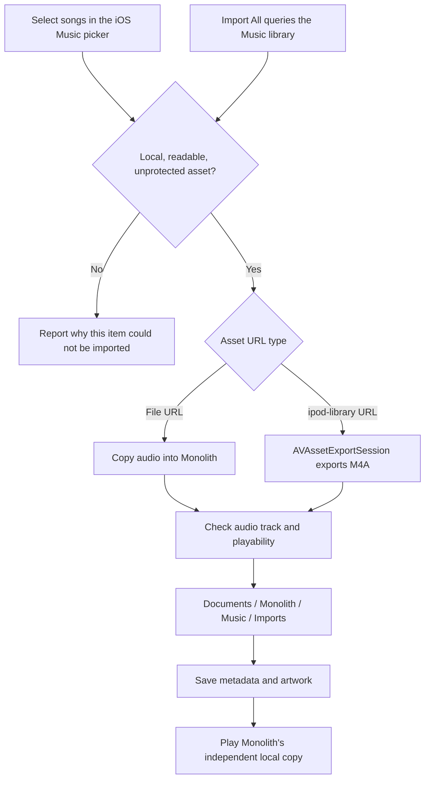
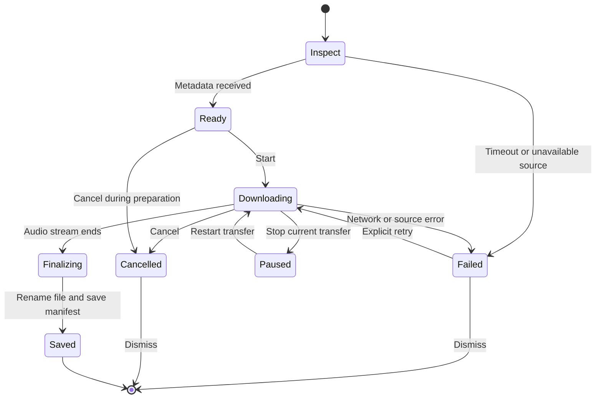
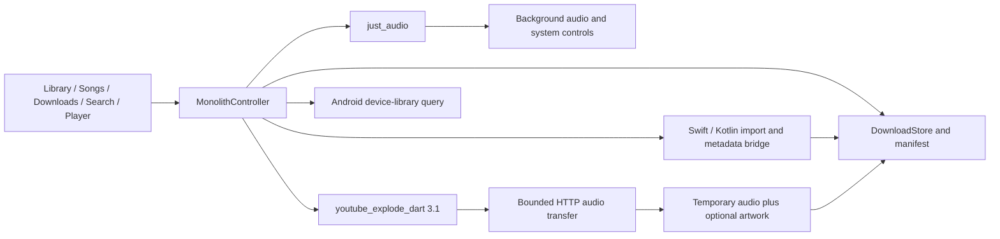

# Monolith

A personal music player for iOS and Android. Bring your own music, keep a local collection, and listen with the screen locked.

**v1.4.4 · Build 13:** this reliability release addresses audit findings across storage recovery, playlist persistence, Android back navigation, queue management, and responsive UI scaling. The iOS changes still require an iPhone test; downloads are not confirmed fixed on the user's device.

## Screenshots

Six actual Pixel 10a emulator captures with the current coral accent, alternating light and dark: three of each. They show local test audio and a public test download. These are Android captures; iPhone verification remains separate.

| Library · Light | Songs · Dark | Player · Light |
| --- | --- | --- |
|  |  |  |

| Downloads · Dark | Search · Light | Settings · Dark |
| --- | --- | --- |
|  |  |  |

## Your collection

- Import readable songs from the iOS Music picker, import the accessible local Music library in one batch, or choose audio files from Files. Failed items retain their individual reasons.
- Browse songs, artists, albums, playlists, and recent additions.
- Open the activity dropdown below the header to inspect concurrent transfers and stop individual jobs.
- Download supported YouTube audio and its thumbnail. Completed downloads appear in Downloads; imported files remain in Library and Songs.
- Read missing durations from native audio metadata without playing every song.
- Play local files through `just_audio`, with background playback and system media controls.
- Export copies through Files on iOS or the Android document picker.
- Choose light/dark appearance, accent color, and reduced visual effects. Equalizer controls are Android-only.

<details>
<summary><strong>Why I built this</strong></summary>

<br/>

I got tired of the choice: either manage downloads on Windows and manually transfer files, or rely on some third-party app on my phone with questionable quality and even more questionable permissions. Every existing solution felt like a compromise.

So I thought — if I'm already trusting a third-party app, why not just build my own? At least then it would work exactly how I want, respect my library as *mine*, and actually handle offline playback without nagging me to subscribe to something.

**Monolith is that app** — a personal project that turned into something I use every day.

</details>

## How iOS Music imports work

Music exposes selected items as media assets. An `ipod-library://` URL is not an ordinary file path. Monolith's Swift bridge either copies a readable file or asks AVFoundation to export the selected asset to an M4A file. It validates that the result has a playable audio track, then saves duration, title, artist, and available artwork.



**Can the originals or Music app be removed afterwards?** A successful import is an independent copy inside Monolith. It does not depend on the original Music item for playback. Before removing originals, confirm the songs appear in Monolith, close and reopen it, test playback in airplane mode, and export a backup to a location outside Monolith. This is especially important for files imported by older builds that showed “Cannot Open.”

Protected subscription tracks and unavailable cloud-only items are not copied. Jailbreak/TrollStore installation does not turn those assets into unprotected files. Removing **Monolith itself** can remove its stored music; removing Music and removing Monolith are different operations. See [storage and backups](docs/storage.md).

The platform API details are described in Apple's [assetURL documentation](https://developer.apple.com/documentation/mediaplayer/mpmediaitem/asseturl) and [protected asset flag](https://developer.apple.com/documentation/mediaplayer/mpmediaitem/hasprotectedasset).

## Download lifecycle

Inspection retrieves the title, duration, and thumbnail. Transfer requests are bounded, verify byte counts, and prefer standard AAC. At most two mobile manifests are tried. When audio-only streams fail, Monolith can download the smallest compatible MP4 and extract only its AAC track locally, without re-encoding; temporary video is removed. Each manifest offers at most one audio-only and one combined-stream attempt; a rejected or empty stream becomes a visible failure instead of an endless zero-byte task. Some YouTube sources still return HTTP 403; the transport cannot guarantee every video is available. The download reuses that preview, resolves an AAC/MP4 stream for iOS, and writes to a temporary `.part` file. Only completed audio is renamed into the music folder and added to the manifest. Thumbnail failure does not fail audio. Lyrics are independent of downloads.



Cancelled and dismissed jobs ignore late events. “Resume” restarts the transfer; byte-range resume is not implemented. Files already in the library are not removed when another download fails.

## Architecture



The live application starts at `lib/main.dart` and uses `lib/src/`. The repository also contains an in-progress alternative domain/repository layer; it does not own the live player. See [architecture and invariants](docs/architecture.md) for playback, recovery, and update flows.

## Install and build

APK/IPA files are available on [GitHub Releases](https://github.com/naveed-gung/Monolith/releases). Each platform's package appears after its release workflow completes successfully.

- Android: install a compatible APK over the existing app, with the same application ID and signing key.
- iOS: this project targets the user's TrollStore installation. Build/package the IPA on macOS with Xcode; no Apple Developer signing flow was added here. Use TrollStore on a supported device and replace the installed app rather than deleting it first.
- Desktop: deferred. Windows/Linux feature parity and the requested under-150 MB memory budget have not been demonstrated.

```sh
flutter pub get
flutter analyze
flutter test
flutter build apk --release
# On macOS with Xcode and CocoaPods:
flutter build ios --release --no-codesign
```

Downloaded IPAs are recovered from the update cache across restarts. **Open downloaded IPA…** shares the existing local package to TrollStore or Files; it never silently starts a remote installer download. Opening an installer is not treated as proof of installation.

The repository's debug APK configuration targets x86_64 emulators; its release configuration targets arm64 phones. Release builds use Gradle 8.14.5 with AGP 8.9.1 and build successfully on GitHub Actions CI.

## Verification and remaining checks

- **129 tests pass; Dart analysis reports no issues.** The regression suite covers the active controller, storage recovery, responsive UI matrix, and existing repository tests.
- Regression coverage includes nonzero volume when changing songs, preserving playback on refresh/download completion, cancellation during preparation, source classification, duration caching, schema migration, and existing UI/import/export/update behavior.
- This patch passes an Android emulator debug build. Six fresh screenshots show the current coral accent in three light and three dark screens, and existing songs survived an in-place APK replacement.
- The new transfer completed a short public AAC source locally (309,288 bytes). The audio-only path for a longer source failed with HTTP 403; its combined-stream fallback subsequently completed all 28,523,658 bytes locally. The user reports that every selected song fails on their iPhone; that device's download failure is not yet verified as resolved.
- On-device Music import/export, locked playback, TrollStore replacement, and physical-device heat measurements remain device checks. A successful Android test does not establish these iOS results.

See the [reliability patch handoff](plans/v141-reliability-handoff.md) for behavior changes, regression coverage, and remaining iPhone checks.

##  License

Monolith is **source-available**, not open-source.

- ✅ **Personal use is free** — use it, build it, modify it for yourself.
- 💼 **Commercial use requires a paid license.** Publishing to the App Store / Google Play, or any revenue-generating or commercial use, requires a signed commercial agreement with the author. Unauthorised commercial use is a license violation and legally actionable.

See [**LICENSE**](LICENSE) for the full terms. For a commercial license, contact **Naveed Sohail Gung** — naveedsohailg@gmail.com.

<div align="center">
<sub>📓 Release notes live in the <a href="CHANGELOG.md">Changelog</a></sub><br/>
<sub>Built by <a href="https://github.com/naveed-gung">naveed-gung</a> · © 2026 Naveed Sohail Gung</sub>
</div>
