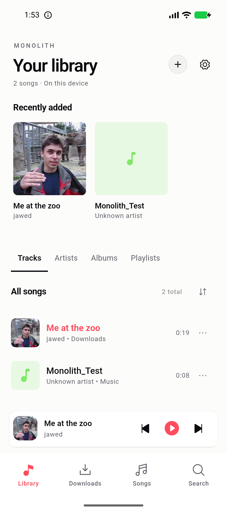
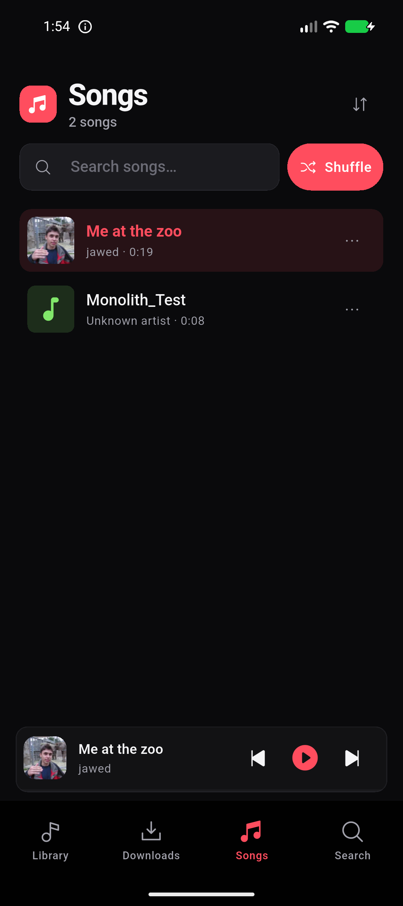
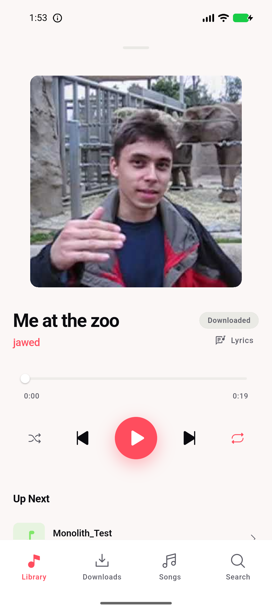
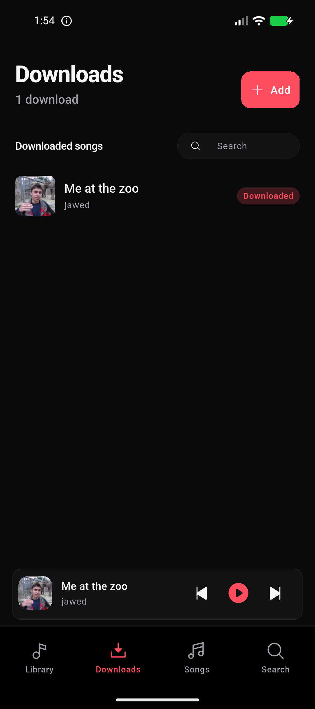
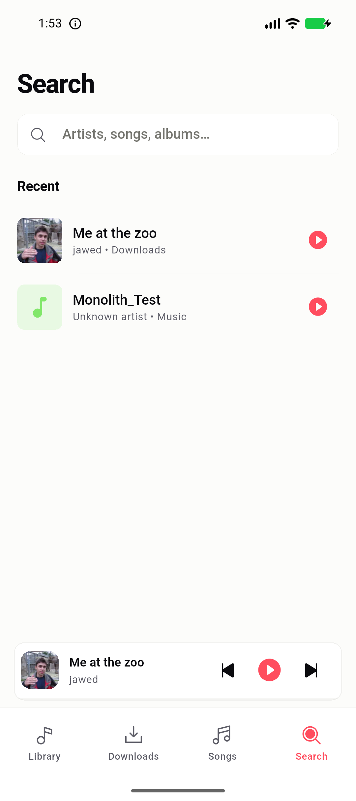
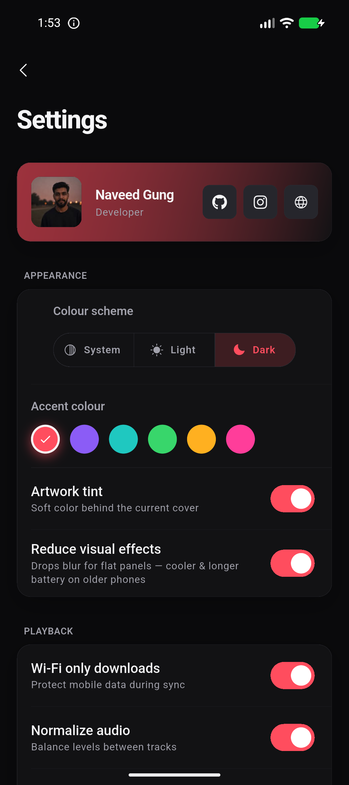
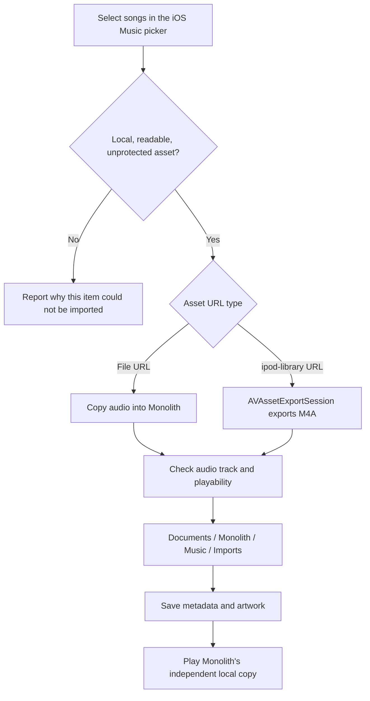
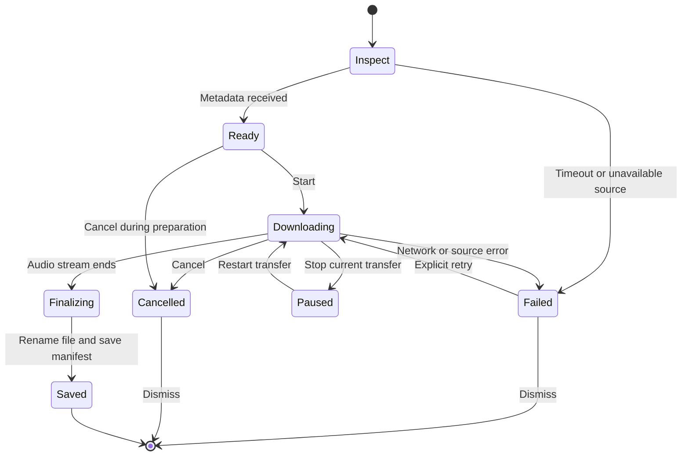
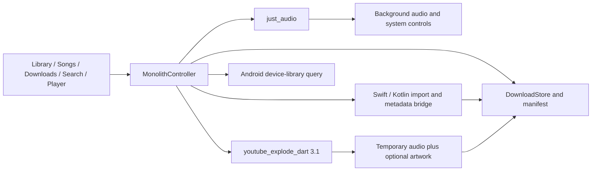

# Monolith

A personal music player for iOS and Android. Bring your own music, keep a local collection, and listen with the screen locked.

**Local development update:** the screenshots and reliability changes below are from the working tree. They have not been committed, pushed, or published. The iOS changes require an iPhone test before release.

## Screenshots

Actual captures from the Pixel 10a emulator, using a local test tone and a short public download. The shared Flutter interface uses a light canvas, compact lists, square artwork, and a persistent mini-player. These are Android captures, not iPhone screenshots.

| Library | Songs | Player |
| --- | --- | --- |
|  |  |  |

| Downloads | Search | Settings |
| --- | --- | --- |
|  |  |  |

## Your collection

- Import readable songs from the iOS Music picker or audio files from Files.
- Browse songs, artists, albums, playlists, and recent additions.
- Download supported YouTube audio and its thumbnail. Completed downloads appear in Downloads; imported files remain in Library and Songs.
- Read missing durations from native audio metadata without playing every song.
- Play local files through `just_audio`, with background playback and system media controls.
- Export copies through Files on iOS or the Android document picker.
- Choose light/dark appearance, accent color, and reduced visual effects. Equalizer controls are Android-only.

<details>
<summary><strong>Why I built this</strong></summary>

<br/>

I got tired of the choice: either manage downloads on Windows and manually transfer files, or rely on some third-party app on my phone with questionable quality and even more questionable permissions. Every existing solution felt like a compromise.

So I thought — if I'm already trusting a third-party app, why not just build my own? At least then it would work exactly how I want, respect my library as *mine*, and actually handle offline playback without nagging me to subscribe to something.

**Monolith is that app** — a personal project that turned into something I use every day.

</details>

## How iOS Music imports work

Music exposes selected items as media assets. An `ipod-library://` URL is not an ordinary file path. Monolith's Swift bridge either copies a readable file or asks AVFoundation to export the selected asset to an M4A file. It validates that the result has a playable audio track, then saves duration, title, artist, and available artwork.



**Can the originals or Music app be removed afterwards?** A successful import is an independent copy inside Monolith. It does not depend on the original Music item for playback. Before removing originals, confirm the songs appear in Monolith, close and reopen it, test playback in airplane mode, and export a backup to a location outside Monolith. This is especially important for files imported by older builds that showed “Cannot Open.”

Protected subscription tracks and unavailable cloud-only items are not copied. Jailbreak/TrollStore installation does not turn those assets into unprotected files. Removing **Monolith itself** can remove its stored music; removing Music and removing Monolith are different operations. See [storage and backups](docs/storage.md).

The platform API details are described in Apple's [assetURL documentation](https://developer.apple.com/documentation/mediaplayer/mpmediaitem/asseturl) and [protected asset flag](https://developer.apple.com/documentation/mediaplayer/mpmediaitem/hasprotectedasset).

## Download lifecycle

Inspection retrieves the title, duration, and thumbnail. The download reuses that preview, resolves an AAC/MP4 stream for iOS, and writes to a temporary `.part` file. Only completed audio is renamed into the music folder and added to the manifest. Thumbnail failure does not fail audio. Lyrics are independent of downloads.



Cancelled and dismissed jobs ignore late events. “Resume” restarts the transfer; byte-range resume is not implemented. Files already in the library are not removed when another download fails.

## Architecture



The live application starts at `lib/main.dart` and uses `lib/src/`. The repository also contains an in-progress alternative domain/repository layer; it does not own the live player. See [architecture and invariants](docs/architecture.md) for playback, recovery, and update flows.

## Install and build

Previously published APK/IPA files are available on [GitHub Releases](https://github.com/naveed-gung/Monolith/releases). Those releases do not contain this unpublished working-tree update.

- Android: install a compatible APK over the existing app, with the same application ID and signing key.
- iOS: this project targets the user's TrollStore installation. Build/package the IPA on macOS with Xcode; no Apple Developer signing flow was added here. Use TrollStore on a supported device and replace the installed app rather than deleting it first.
- Desktop: deferred. Windows/Linux feature parity and the requested under-150 MB memory budget have not been demonstrated.

```sh
flutter pub get
flutter analyze
flutter test
flutter build apk --release
# On macOS with Xcode and CocoaPods:
flutter build ios --release --no-codesign
```

The repository's debug APK configuration targets x86_64 emulators; its release configuration targets arm64 phones. Release builds use Gradle 8.14.5 with AGP 8.9.1 and build successfully on GitHub Actions CI.

## Verification and remaining checks

- **54 tests pass; Dart analysis reports no issues.** The regression suite covers the active controller as well as existing repository tests.
- Regression coverage includes nonzero volume when changing songs, preserving playback on refresh/download completion, cancellation during preparation, source classification, duration caching, schema migration, and existing UI/import/export/update behavior.
- Android builds and six emulator screenshots are checked locally. The app completed a real YouTube download with artwork, and both songs remained after another in-place APK replacement. Foreground/background playback was verified through Android media-session state. The extractor also completed a separate AAC transfer smoke test.
- iOS Swift compilation, on-device Music import/export, locked playback, TrollStore replacement, and physical-device heat measurements remain device checks. A successful Android test does not establish these iOS results.

##  License

Monolith is **source-available**, not open-source.

- ✅ **Personal use is free** — use it, build it, modify it for yourself.
- 💼 **Commercial use requires a paid license.** Publishing to the App Store / Google Play, or any revenue-generating or commercial use, requires a signed commercial agreement with the author. Unauthorised commercial use is a license violation and legally actionable.

See [**LICENSE**](LICENSE) for the full terms. For a commercial license, contact **Naveed Sohail Gung** — naveedsohailg@gmail.com.

<div align="center">
<sub>📓 Release notes live in the <a href="CHANGELOG.md">Changelog</a></sub><br/>
<sub>Built by <a href="https://github.com/naveed-gung">naveed-gung</a> · © 2026 Naveed Sohail Gung</sub>
</div>
