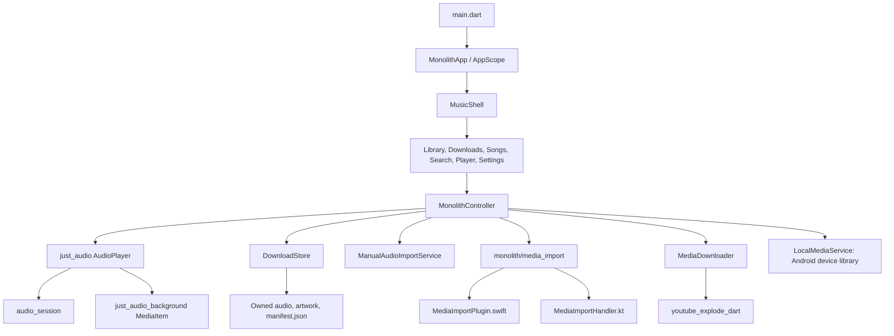
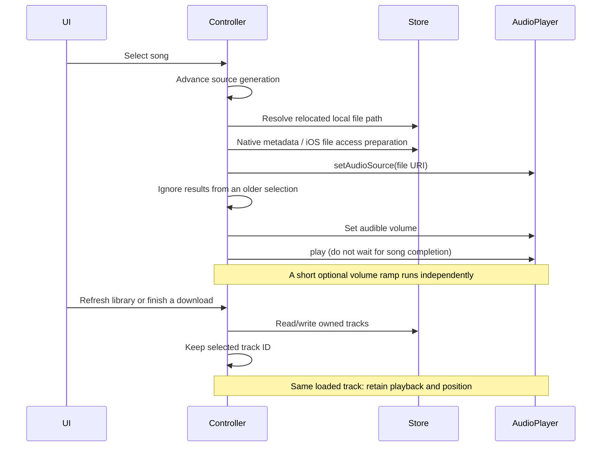
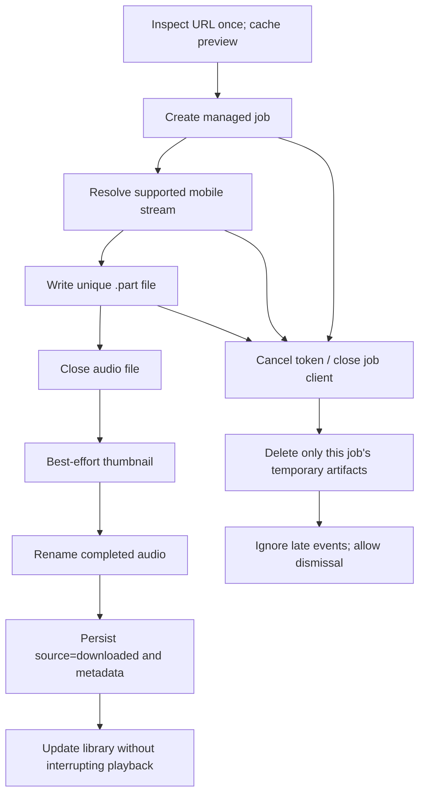
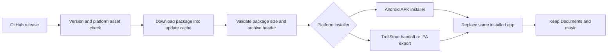

# Architecture

The live app is `lib/main.dart` → `MonolithApp` → `MonolithController` → `MusicShell`. `AppScope` exposes controller state to the feature screens. The alternative `lib/data`, `lib/domain`, and Riverpod modules are not the live playback/download implementation; the shared native import channel is used by the live controller.

## Components



## iOS import: copy ownership

```mermaid
sequenceDiagram
    actor User
    participant UI as Flutter UI
    participant Bridge as Swift media bridge
    participant Music as iOS Music library
    participant AV as AVFoundation
    participant Disk as Monolith Documents
    participant State as Controller / manifest
    User->>UI: Import from Music
    UI->>Bridge: pickFromMusicLibrary
    Bridge->>Music: Permission and MPMediaPickerController
    Music-->>Bridge: Selected MPMediaItems
    loop Each selected item
        Bridge->>Bridge: Check assetURL and protected flag
        alt File URL
            Bridge->>Disk: Copy original bytes
        else ipod-library asset
            Bridge->>AV: Export asset using AppleM4A preset
            AV->>Disk: Write independent M4A
        end
        Bridge->>AV: Validate audio tracks and playability
        Bridge->>Disk: Save available artwork; allow locked-device reads
        Bridge-->>UI: Copied path, title, artist, duration OR failure reason
    end
    UI->>State: Add successful copies and save manifest
    State->>Disk: Playback uses the copied file
```

No filesystem copy is attempted on `ipod-library://` URLs. Protected or unavailable items are reported and skipped. The Music database is not queried as a second iOS playback library: this avoids pseudo-path playback and double counts. Android still queries its device media library and deduplicates paths already owned by Monolith.

## Playback and refresh



`AudioPlayer.play()` completes when playback ends, pauses, or stops. Awaiting it before restoring volume caused silent playback. The controller now keeps source identity and guards late asynchronous load results. Only duration events belonging to the loaded track are persisted.

Position updates use small listenables instead of rebuilding the whole application. Download progress is throttled to four updates per second. Artwork decode size and Flutter image cache are bounded. The player no longer runs a decorative reactive glow. These remove unnecessary work; device temperature still needs measurement on the target iPhone.

## Download state and ownership



- Metadata and stream resolution have timeouts; stream inactivity is bounded.
- Each transfer owns its network client and unique output path. Cancellation is recorded before awaiting the provider.
- A provider finishing does not mark a UI task saved until persistence finishes.
- Pause cancels the current transfer; resume restarts it. It is not byte-range resume.
- Provider extraction failures require an explicit retry. There is no nonexistent yt-dlp binary update loop.
- The download path has no lyric dependency.
- iOS selects MP4/AAC audio; unsupported containers are not disguised with an M4A extension.

## Storage and startup recovery

The owned root is `Documents/Monolith` on iOS and the app external files `Monolith` directory on Android. `Music/Imports` contains imported copies; `Music` contains downloads. See [storage.md](storage.md).

```mermaid
flowchart LR
    Launch[Launch / refresh] --> Manifest[Read legacy list or schema-v2 manifest]
    Manifest --> Rebind[Rebind paths after container relocation]
    Rebind --> Scan[Merge surviving audio files]
    Scan --> Classify[Preserve Imports source; ignore .part files]
    Classify --> Metadata[Probe unknown durations with native readers]
    Metadata --> Cache[Persist resolved metadata]
    Cache --> Display[Publish collection and real count]
```



Missing files are omitted from the visible snapshot, but reading does not intentionally prune their manifest entries. Source, artwork, dates, counts, and fallback colors survive supported manifest formats. Concurrent refresh results use a generation guard; an older request cannot replace a newer snapshot.

## Updating the installed app



Downloaded update packages are separate from the music directory. Installer handoff is not proof of a completed installation. Preserving data depends on replacing the same app instead of deleting it. This task did not commit, push, publish, or run a GitHub release workflow.

## Verification boundaries

The automated suite exercises controller behavior, disk recovery, source separation, cancellation, metadata persistence, UI flows, and the pre-existing import/export/update repositories. Android compilation checks the Kotlin metadata bridge. A desktop extractor smoke test verified a complete AAC transfer.

Swift compilation and real Music-library access cannot be established on Windows. Validate import/export, previously failing files, background/locked playback, and TrollStore replacement on the actual iPhone. Windows/Linux ports remain deferred until feature parity and the requested memory budget can be demonstrated.
