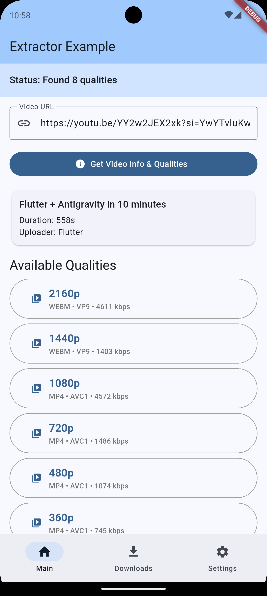
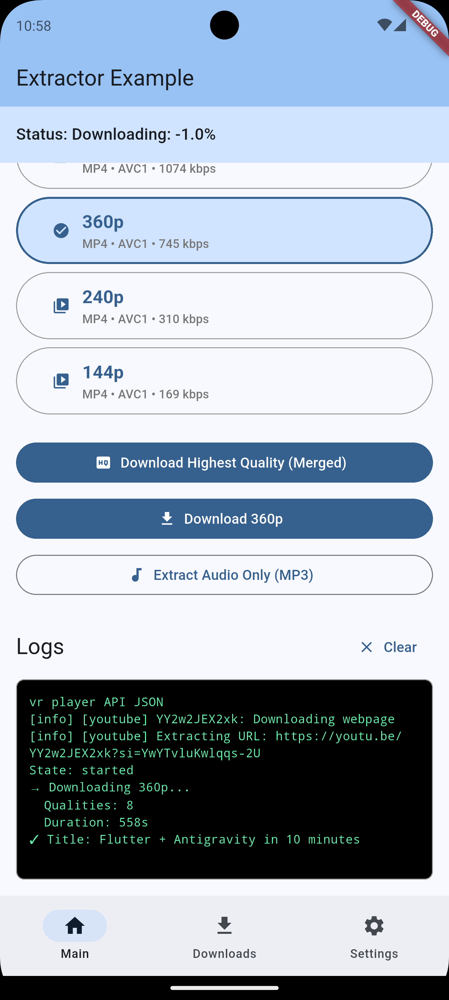
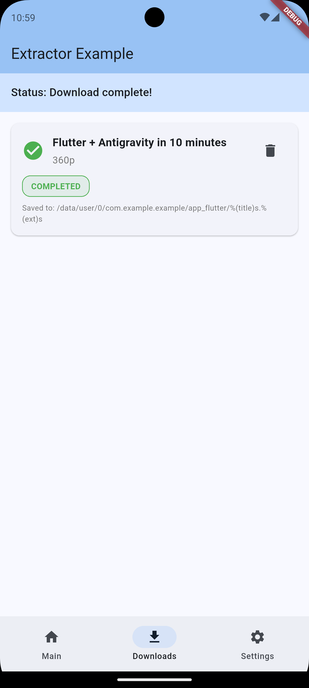
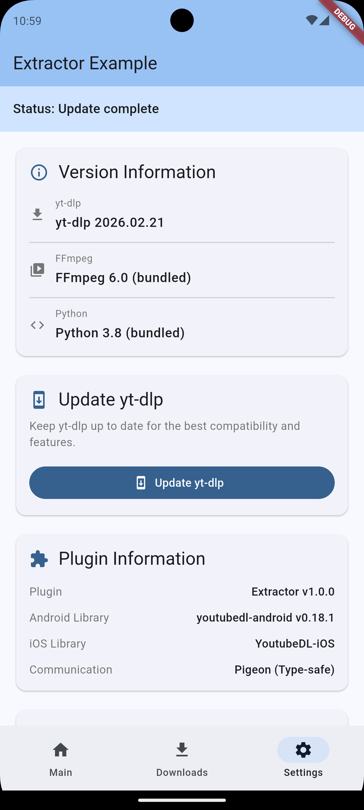
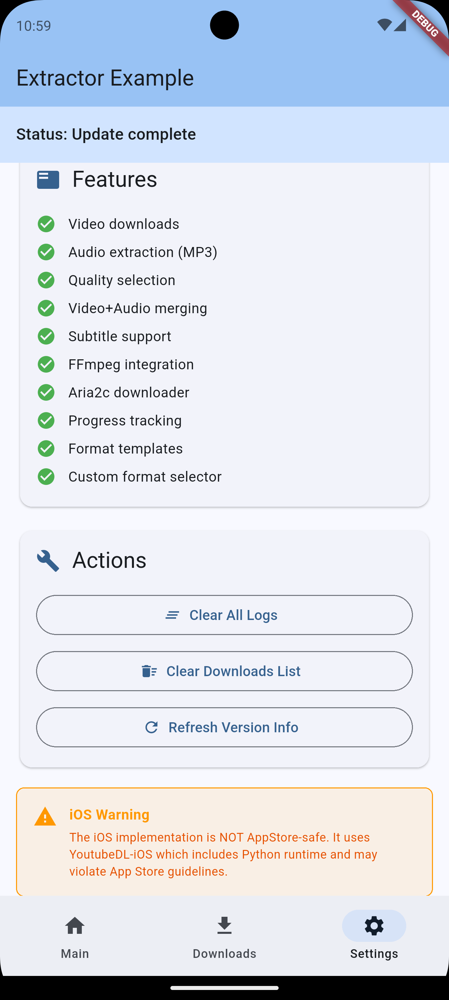

# Extractor - Flutter Video Downloader Plugin

A robust, production-ready Flutter plugin for downloading videos and audio from 1000+ websites using yt-dlp. Built with native Android (Kotlin) implementation.

[](https://github.com/ashishpipaliya/extractor)
[](LICENSE)

## Platform Support

| Platform | Status | Implementation |
|----------|--------|----------------|
| Android  | ✅ Fully Supported | Native Kotlin + youtubedl-android |
| iOS | 💡 Open for Contributions | See [iOS Support](#-ios-support) below |

## 📱 Screenshots (example app)

<table>
  <tr>
    <td></td>
    <td></td>
    <td></td>
  </tr>
  <tr>
    <td align="center"><b>Quality Selection</b><br/>Browse and select video quality</td>
    <td align="center"><b>Download Progress</b><br/>Real-time progress with logs</td>
    <td align="center"><b>Downloads Manager</b><br/>View completed downloads</td>
  </tr>
  <tr>
    <td></td>
    <td></td>
    <td></td>
  </tr>
  <tr>
    <td align="center"><b>Version Information</b><br/>Check library versions</td>
    <td align="center"><b>Features List</b><br/>All plugin capabilities</td>
    <td></td>
  </tr>
</table>

## ✨ Features

### Core Functionality
- 🎥 **Download videos** from 1000+ websites (YouTube, Vimeo, Dailymotion, etc.)
- 🎵 **Extract audio** with format conversion (MP3, M4A, WAV, FLAC, AAC, OPUS)
- 📊 **Get video information** (title, duration, formats, thumbnails, metadata)
- 🎬 **Format selection** - Choose quality, resolution, codec
- 📝 **Subtitle support** - Download and embed subtitles in multiple languages
- 🖼️ **Thumbnail embedding** - Embed video thumbnails in audio files
- 📋 **Metadata embedding** - Add title, artist, album info
- ⚡ **Aria2c integration** - Faster downloads with external downloader
- 🔄 **Progress tracking** - Real-time progress updates with ETA
- ⏸️ **Download management** - Cancel, pause, resume downloads
- 🔄 **Update yt-dlp** - Update to latest stable version

### Advanced Features
- 🎯 **Download templates** - Pre-configured quality presets (Best, 1080p, 720p, 480p, Audio Only, Small Size)
- 🎨 **Custom format strings** - Advanced format selection with yt-dlp syntax
- 🔧 **Custom yt-dlp options** - Pass any yt-dlp command-line option
- 📦 **Playlist support** - Download entire playlists or individual videos
- 🎭 **Chapter support** - Preserve video chapters
- 🌐 **Multi-language subtitles** - Download subtitles in any language
- 🔐 **Cookie support** - Use cookies for authentication (planned)
- 📱 **Scoped storage** - Android 10+ compliant storage handling

### Architecture & Code Quality
- 🏗️ **Clean Architecture** - SOLID principles with separation of concerns
- 🔒 **Type-safe Communication** - Pigeon for compile-time type safety
- 🧩 **Service Layer Pattern** - LibraryService, UpdateService, InfoService, DownloadService
- 🧵 **Thread Safety** - Proper threading with coroutines (Android)
- 📝 **Well Documented** - Comprehensive API documentation
- ✅ **Production Ready** - Battle-tested architecture

### Example App Features
- 🎨 **Material Design 3** - Modern UI with dynamic colors
- 📱 **Inline Format Selection** - Horizontal scrollable quality cards
- 📥 **Downloads Manager** - View and manage downloaded files
- 💾 **Save to Gallery** - Export videos to public storage
- 📊 **File Management** - View info, share, delete files
- ⚙️ **Settings Page** - Version info, updates, library management
- 🌓 **Dark Mode** - Automatic theme switching

## 📦 Installation

Add to your `pubspec.yaml`:

```yaml
dependencies:
  extractor: latest
```

### Android Requirements

**Minimum SDK version (API 24+):**

```gradle
android {
    defaultConfig {
        minSdk = 24
    }
}
```

**Required:** Set `extractNativeLibs` in `AndroidManifest.xml`:

```xml
<application
    android:extractNativeLibs="true"
    ...>
```

## 🚀 Quick Start

### Initialize

```dart
import 'package:extractor/extractor.dart';

final youtubeDL = YoutubeDLFlutter.instance;

// Initialize with FFmpeg and Aria2c
final result = await youtubeDL.initialize(
  enableFFmpeg: true,
  enableAria2c: true,
);

if (result.success) {
  print('Initialized successfully');
} else {
  print('Error: ${result.errorMessage}');
}
```

### Get Video Information

```dart
try {
  final info = await youtubeDL.getVideoInfo('https://www.youtube.com/watch?v=dQw4w9WgXcQ');
  
  print('Title: ${info.title}');
  print('Duration: ${info.duration} seconds');
  print('Uploader: ${info.uploader}');
  print('Thumbnail: ${info.thumbnail}');
  print('Available formats: ${info.formats?.length}');
  
  // List all formats
  info.formats?.forEach((format) {
    print('Format: ${format?.formatId} - ${format?.resolution} - ${format?.ext}');
  });
} catch (e) {
  print('Error: $e');
}
```

### Download Video

```dart
import 'dart:io';
import 'package:path_provider/path_provider.dart';

// Get download directory
final dir = await getExternalStorageDirectory();
final downloadPath = '${dir!.path}/Downloads';

// Create download request
final request = DownloadRequest(
  url: 'https://www.youtube.com/watch?v=dQw4w9WgXcQ',
  outputPath: downloadPath,
  outputTemplate: '%(title)s.%(ext)s',
  format: 'bestvideo+bestaudio/best', // Best quality
  processId: 'download_${DateTime.now().millisecondsSinceEpoch}',
  embedThumbnail: true,
  embedMetadata: true,
  customOptions: {
    '--downloader': 'libaria2c.so', // Use Aria2c for faster downloads
  },
);

// Start download
try {
  final result = await youtubeDL.download(request);
  
  if (result.status == OperationStatus.success) {
    print('Downloaded to: ${result.outputPath}');
  } else {
    print('Download failed: ${result.errorMessage}');
  }
} catch (e) {
  print('Error: $e');
}
```

### Download Audio Only

```dart
final request = DownloadRequest(
  url: 'https://www.youtube.com/watch?v=dQw4w9WgXcQ',
  outputPath: downloadPath,
  outputTemplate: '%(title)s.%(ext)s',
  extractAudio: true,
  audioFormat: 'mp3',
  audioQuality: 0, // Best quality (0-9, 0 is best)
  embedThumbnail: true,
  embedMetadata: true,
  processId: 'audio_${DateTime.now().millisecondsSinceEpoch}',
);

final result = await youtubeDL.download(request);
```

### Track Download Progress

```dart
// Listen to progress updates
youtubeDL.onProgress.listen((progress) {
  print('Process: ${progress.processId}');
  print('Progress: ${progress.progress}%');
  print('ETA: ${progress.eta.inSeconds} seconds');
});

// Listen to state changes
youtubeDL.onStateChanged.listen((state) {
  print('Process: ${state.processId}');
  print('State: ${state.state}'); // started, completed, cancelled
});

// Listen to errors
youtubeDL.onError.listen((error) {
  print('Process: ${error.processId}');
  print('Error: ${error.error}');
});
```

### Cancel Download

```dart
final cancelled = await youtubeDL.cancelDownload(processId: 'download_123');
if (cancelled) {
  print('Download cancelled');
}
```

### Update yt-dlp

```dart
final result = await youtubeDL.updateYoutubeDL(channel: UpdateChannel.stable);

if (result.status == OperationStatus.success) {
  print('Updated to: ${result.version}');
} else {
  print('Update failed: ${result.errorMessage}');
}
```

### Get Version Information

```dart
final versionInfo = await youtubeDL.getVersion();

print('yt-dlp: ${versionInfo.youtubeDlVersion}');
print('FFmpeg: ${versionInfo.ffmpegVersion}');
print('Python: ${versionInfo.pythonVersion}');
```

## 📚 Download Templates

Pre-configured quality presets for common use cases:

```dart
import 'package:extractor/extractor.dart';

// Best Quality (highest resolution + audio)
final bestQuality = DownloadTemplates.bestQuality(
  url: videoUrl,
  outputPath: downloadPath,
);

// Audio Only (best quality)
final audioOnly = DownloadTemplates.audioOnly(
  url: videoUrl,
  outputPath: downloadPath,
  audioFormat: 'mp3',
);

// 1080p Video
final video1080p = DownloadTemplates.video1080p(
  url: videoUrl,
  outputPath: downloadPath,
);

// 720p Video
final video720p = DownloadTemplates.video720p(
  url: videoUrl,
  outputPath: downloadPath,
);

// 480p Video
final video480p = DownloadTemplates.video480p(
  url: videoUrl,
  outputPath: downloadPath,
);

// Small Size (best video under 100MB)
final smallSize = DownloadTemplates.smallSize(
  url: videoUrl,
  outputPath: downloadPath,
);

// Use template
final result = await youtubeDL.download(bestQuality);
```

## 🎯 Advanced Usage

### Custom Format Selection

```dart
// Download specific format by ID
final request = DownloadRequest(
  url: videoUrl,
  outputPath: downloadPath,
  format: '137+140', // Format IDs from getVideoInfo()
);

// Download best video with height <= 720p
final request = DownloadRequest(
  url: videoUrl,
  outputPath: downloadPath,
  format: 'bestvideo[height<=720]+bestaudio/best[height<=720]',
);

// Download best MP4 video
final request = DownloadRequest(
  url: videoUrl,
  outputPath: downloadPath,
  format: 'bestvideo[ext=mp4]+bestaudio[ext=m4a]/best[ext=mp4]',
);
```

### Subtitle Download

```dart
final request = DownloadRequest(
  url: videoUrl,
  outputPath: downloadPath,
  writeSubtitles: true,
  writeAutoSubtitles: true,
  embedSubtitles: true,
  subtitlesLang: 'en,es,fr', // Multiple languages
);
```

### Custom yt-dlp Options

```dart
final request = DownloadRequest(
  url: videoUrl,
  outputPath: downloadPath,
  customOptions: {
    '--no-playlist': '', // Don't download playlist
    '--max-downloads': '5', // Limit downloads
    '--rate-limit': '1M', // Limit download speed
    '--retries': '10', // Retry attempts
    '--fragment-retries': '10',
    '--skip-unavailable-fragments': '',
    '--no-mtime': '', // Don't use Last-modified header
    '--no-update': '', // Suppress update warning
  },
);
```

### Playlist Handling

```dart
// Download entire playlist
final request = DownloadRequest(
  url: 'https://www.youtube.com/playlist?list=...',
  outputPath: downloadPath,
  noPlaylist: false, // Allow playlist
  outputTemplate: '%(playlist_index)s - %(title)s.%(ext)s',
);

// Download only first video from playlist
final request = DownloadRequest(
  url: 'https://www.youtube.com/playlist?list=...',
  outputPath: downloadPath,
  noPlaylist: true, // Skip playlist
);
```

## 📱 Example App

The example app demonstrates all features:

- **Main Page**: URL input, video info display, inline format selection
- **Downloads Page**: View downloaded files, save to gallery, file management
- **Settings Page**: Version info, update yt-dlp, library information

Run the example:

```bash
cd example
flutter run
```

## 🏗️ Architecture

### Service Layer

```
ExtractorPlugin (Main)
    └── YoutubeDLManager (Coordinator)
            ├── LibraryService (Initialization & Versions)
            ├── UpdateService (Binary Updates)
            ├── InfoService (Video Information)
            ├── DownloadService (Downloads & Progress)
            └── VideoInfoMapper (JSON Mapping)
```

### Communication

- **Pigeon**: Type-safe communication between Dart and native code
- **Streams**: Real-time progress updates via Dart streams
- **Coroutines**: Async operations on Android

## 📊 Supported Platforms

### Video Platforms (1000+)

YouTube, Vimeo, Dailymotion, Facebook, Instagram, Twitter, TikTok, Reddit, Twitch, SoundCloud, Bandcamp, and [many more](https://github.com/yt-dlp/yt-dlp/blob/master/supportedsites.md).

### Audio Formats

MP3, M4A, WAV, FLAC, AAC, OPUS, OGG, VORBIS

### Video Formats

MP4, MKV, WEBM, AVI, FLV, MOV

### Subtitle Formats

SRT, VTT, ASS, LRC

## 🔧 Troubleshooting

### Android

**Build Error: NDK version mismatch**
```gradle
// In android/app/build.gradle
android {
    ndkVersion = "27.0.12077973"
}
```

**Build Error: extractNativeLibs**
- Ensure `android:extractNativeLibs="true"` is set in AndroidManifest.xml
- This is required for the plugin to extract native libraries

**Update Failed**
- Check internet connection
- Ensure sufficient storage space
- Try again later (GitHub API rate limits)

**Download Failed**
- Verify the URL is supported (check [supported sites](https://github.com/yt-dlp/yt-dlp/blob/master/supportedsites.md))
- Check internet connection
- Try updating yt-dlp to the latest version
- Some sites may require cookies or authentication

## 💡 iOS Support

Currently, this plugin only supports Android. iOS implementation is open for contributions!

If you're interested in adding iOS support, here are some approaches to consider:

1. **Rust + FFI**: Use Rust with flutter_rust_bridge for cross-platform yt-dlp integration
2. **Native Swift**: Port the Android implementation to Swift/Objective-C
3. **Server-side**: Implement a backend service for video processing (recommended for App Store apps)

Feel free to open an issue or pull request if you'd like to contribute iOS support!

## 📝 API Reference

### Core Methods

#### initialize()
Initialize the library with configuration.

```dart
Future<InitResult> initialize({
  bool enableFFmpeg = true,
  bool enableAria2c = false,
})
```

#### getVideoInfo()
Get video information without downloading.

```dart
Future<VideoInfo> getVideoInfo(String url)
```

Returns: `VideoInfo` with title, duration, formats, thumbnail, uploader, etc.

#### download()
Download a video with specified configuration.

```dart
Future<DownloadResult> download(DownloadRequest request)
```

#### cancelDownload()
Cancel an active download by process ID.

```dart
Future<bool> cancelDownload(String processId)
```

#### updateYoutubeDL()
Update yt-dlp binary to the latest version.

```dart
Future<UpdateResult> updateYoutubeDL({
  UpdateChannel channel = UpdateChannel.stable,
})
```

#### getVersion()
Get version information for yt-dlp, FFmpeg, and Python.

```dart
Future<VersionInfo> getVersion()
```

### Streams

Listen to real-time updates:

```dart
// Progress updates
Stream<DownloadProgress> get onProgress

// State changes (started, completed, cancelled)
Stream<DownloadState> get onStateChanged

// Errors
Stream<DownloadError> get onError

// Logs (yt-dlp output)
Stream<LogMessage> get onLog
```

### Key Models

#### DownloadRequest
```dart
DownloadRequest({
  required String url,
  required String outputPath,
  String? outputTemplate,        // e.g., '%(title)s.%(ext)s'
  String? format,                 // e.g., 'bestvideo+bestaudio/best'
  bool noPlaylist = true,
  bool extractAudio = false,
  String? audioFormat,            // 'mp3', 'm4a', 'wav', etc.
  int? audioQuality,              // 0-9 (0 is best)
  bool embedThumbnail = false,
  bool embedMetadata = false,
  bool embedSubtitles = false,
  String? subtitlesLang,
  bool writeSubtitles = false,
  bool writeAutoSubtitles = false,
  Map<String, String>? customOptions,
  String? processId,
})
```

#### VideoInfo
```dart
class VideoInfo {
  String? id, title, description;
  String? uploader, uploaderId, uploaderUrl;
  String? channelId, channelUrl;
  int? duration, viewCount, likeCount;
  String? thumbnail, url;
  List<VideoFormat?>? formats;
  String? ext;
  int? width, height, fps;
  String? vcodec, acodec;
}
```

#### VideoFormat
```dart
class VideoFormat {
  String? formatId, formatNote, ext, url;
  int? width, height, fps, filesize, tbr;
  String? vcodec, acodec, resolution;
}
```

### FormatHelper Utilities

```dart
// Get best video/audio formats
FormatHelper.getBestVideo(formats)
FormatHelper.getBestAudio(formats)

// Filter by resolution
FormatHelper.getFormatsByResolution(formats, minHeight, maxHeight)

// Get specific format types
FormatHelper.getAudioFormats(formats)
FormatHelper.getVideoFormats(formats)

// Format utilities
FormatHelper.formatFileSize(bytes)        // "50.00 MB"
FormatHelper.formatResolution(format)     // "1920x1080"
FormatHelper.getFormatDescription(format) // "1080p • mp4 • 50.00 MB"
```

## 🤝 Contributing

See [CONTRIBUTING.md](CONTRIBUTING.md) for contribution guidelines.

## 📄 License

This project is licensed under the MIT License - see the [LICENSE](LICENSE) file for details.

This plugin uses open-source libraries including youtubedl-android (GPL-3.0). See LICENSE file for third-party acknowledgments.

## 🙏 Credits

- [yt-dlp](https://github.com/yt-dlp/yt-dlp) - The amazing video downloader
- [youtubedl-android](https://github.com/yausername/youtubedl-android) - Android port
- [Pigeon](https://pub.dev/packages/pigeon) - Type-safe native communication

## 📚 Documentation

- [README.md](README.md) - Complete guide with features, installation, usage, and API reference
- [CHANGELOG.md](CHANGELOG.md) - Version history and release notes
- [CONTRIBUTING.md](CONTRIBUTING.md) - Contribution guidelines

## 🔗 Links

- [GitHub Repository](https://github.com/ashishpipaliya/extractor)
- [Issue Tracker](https://github.com/ashishpipaliya/extractor/issues)
- [yt-dlp Documentation](https://github.com/yt-dlp/yt-dlp#readme)

## ⚡ Performance

- **Fast Downloads**: Aria2c integration for multi-connection downloads
- **Efficient**: Lazy extractors for faster startup
- **Optimized**: Native code for best performance
- **Scalable**: Handle multiple concurrent downloads

## 🔒 Security

- **Scoped Storage**: Android 10+ compliant
- **Permission Minimal**: Only requests necessary permissions
- **Type-Safe**: Compile-time type checking with Pigeon

## 📈 Version Information

- **Plugin Version**: 1.0.0
- **youtubedl-android**: v0.18.1
- **yt-dlp**: 2025.11.12 (bundled, updatable)
- **FFmpeg**: 6.0 (bundled)
- **Python**: 3.8 (bundled)
- **Minimum Android**: API 24 (Android 7.0)

---

**Made with ❤️ by Ashish Pipaliya**

**⭐ Star this repo if you find it useful!**
